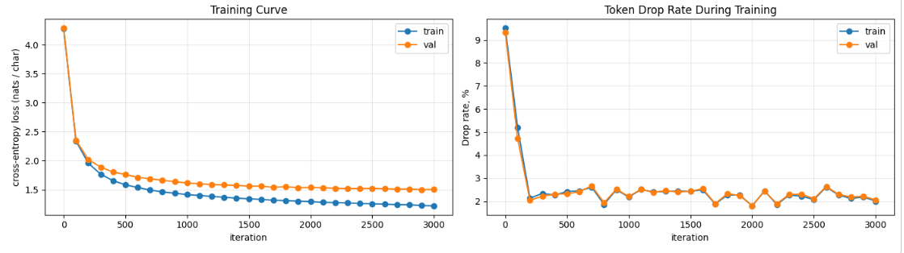

# Build MoE Transformer: Results

Notebook:

```text
4_2_tiny_moe_lm_hometask_Alex_20260517.ipynb
```

Colab T4 run artifact:

```text
4_2_tiny_moe_lm_hometask_Alex_20260517_ColabT4run.ipynb
```

## Summary

The homework implementation adds two main components to the tiny character-level
Transformer language model:

1. **RoPE attention**: rotary position embeddings are applied to query and key
   tensors inside causal self-attention.
2. **MoE feed-forward layers**: each Transformer block replaces the dense
   feed-forward network with a top-2 routed mixture of 8 smaller experts.

The model trains successfully on Tiny Shakespeare and keeps token dropping low
throughout training.

## Implemented Components

### RoPE

The `RoPE` module:

- precomputes sine and cosine caches up to `max_seq_len`
- uses the standard inverse-frequency formula with base `10000`
- implements `rotate_half(x)` as `[x1, x2] -> [-x2, x1]`
- applies rotary embeddings to `q` and `k`
- preserves vector norms, as expected for a rotation

### RoPE Attention

The `MultiHeadSelfAttentionRope` module:

- projects input into `q`, `k`, and `v`
- reshapes tensors to `(batch, heads, seq_len, head_dim)`
- applies RoPE only to `q` and `k`
- keeps causal masking so tokens cannot attend to future positions
- merges attention heads back to `(batch, seq_len, n_embd)`

### MoE

The `MoE` module:

- uses a bias-free linear router from `n_embd` to `num_experts`
- selects top-2 experts per token
- normalizes selected expert weights so they sum to `1.0`
- enforces expert capacity using `capacity_factor`
- drops excess expert assignments when an expert is over capacity
- accumulates expert outputs with `index_add_`
- reports drop rate as:

```text
dropped_assignments / (total_tokens * top_k)
```

### TinyMoeLM

The final model:

- removes learned positional embeddings because RoPE handles position
- stacks `BlockMoe` layers
- averages drop rate across layers
- implements generation with context cropping to `block_size`

## Verification

### Unit Tests

All provided unit tests passed:

```text
Ran 5 tests in 0.075s

OK
```

These covered:

- `RoPE.rotate_half`
- RoPE output shapes
- RoPE norm preservation
- MoE output shape
- MoE `NaN` safety
- zero drop rate with very high capacity
- forced high drop rate with very low capacity

### Full Model Sanity Check

The full-model check passed:

```text
logits.shape: (64, 128, 65)
loss:         4.2588
expected ~:   4.1744

Full-model sanity check passed (forward + generate)
```

The initial loss is close to `log(vocab_size)`, which is expected for an
untrained language model that predicts almost uniformly.

### Parameter Count

The model parameter count was:

```text
Model parameters: 5.36 M
```

This satisfies the notebook constraint:

```text
round(n_params / 1e6, 2) <= 5.4
```

The count is consistent with using 8 half-sized experts rather than full-sized
experts.

## Training Run

Training was run on Colab with a T4 GPU. The executed notebook with outputs is
saved as:

```text
4_2_tiny_moe_lm_hometask_Alex_20260517_ColabT4run.ipynb
```

Hyperparameters:

```text
block_size      = 128
n_embd          = 192
n_head          = 6
n_layer         = 4
dropout         = 0.1
hid_dim         = 4 * n_embd
exp_hid_dim     = hid_dim // 2
num_experts     = 8
top_k           = 2
capacity_factor = 1.25
batch_size      = 64
learning_rate   = 3e-4
max_iters       = 3000
```

Training log:

```text
iter     0 | train loss 4.2837 | val loss 4.2895 | train drop rate 9.5% | val drop rate 9.3%
iter   100 | train loss 2.3373 | val loss 2.3516 | train drop rate 5.2% | val drop rate 4.7%
iter   200 | train loss 1.9553 | val loss 2.0184 | train drop rate 2.1% | val drop rate 2.0%
iter   300 | train loss 1.7653 | val loss 1.8876 | train drop rate 2.3% | val drop rate 2.2%
iter   400 | train loss 1.6526 | val loss 1.8033 | train drop rate 2.3% | val drop rate 2.3%
iter   500 | train loss 1.5822 | val loss 1.7602 | train drop rate 2.4% | val drop rate 2.3%
iter   600 | train loss 1.5347 | val loss 1.7107 | train drop rate 2.4% | val drop rate 2.4%
iter   700 | train loss 1.4915 | val loss 1.6856 | train drop rate 2.6% | val drop rate 2.7%
iter   800 | train loss 1.4587 | val loss 1.6601 | train drop rate 1.9% | val drop rate 1.9%
iter   900 | train loss 1.4368 | val loss 1.6368 | train drop rate 2.5% | val drop rate 2.5%
iter  1000 | train loss 1.4119 | val loss 1.6134 | train drop rate 2.2% | val drop rate 2.2%
iter  1100 | train loss 1.3980 | val loss 1.5996 | train drop rate 2.5% | val drop rate 2.5%
iter  1200 | train loss 1.3813 | val loss 1.5858 | train drop rate 2.4% | val drop rate 2.4%
iter  1300 | train loss 1.3663 | val loss 1.5787 | train drop rate 2.4% | val drop rate 2.5%
iter  1400 | train loss 1.3515 | val loss 1.5706 | train drop rate 2.4% | val drop rate 2.4%
iter  1500 | train loss 1.3397 | val loss 1.5609 | train drop rate 2.4% | val drop rate 2.4%
iter  1600 | train loss 1.3302 | val loss 1.5570 | train drop rate 2.5% | val drop rate 2.5%
iter  1700 | train loss 1.3150 | val loss 1.5394 | train drop rate 1.9% | val drop rate 1.9%
iter  1800 | train loss 1.3084 | val loss 1.5487 | train drop rate 2.3% | val drop rate 2.3%
iter  1900 | train loss 1.2993 | val loss 1.5328 | train drop rate 2.3% | val drop rate 2.2%
iter  2000 | train loss 1.2921 | val loss 1.5346 | train drop rate 1.8% | val drop rate 1.8%
iter  2100 | train loss 1.2794 | val loss 1.5306 | train drop rate 2.4% | val drop rate 2.4%
iter  2200 | train loss 1.2749 | val loss 1.5202 | train drop rate 1.9% | val drop rate 1.9%
iter  2300 | train loss 1.2694 | val loss 1.5174 | train drop rate 2.3% | val drop rate 2.3%
iter  2400 | train loss 1.2589 | val loss 1.5166 | train drop rate 2.2% | val drop rate 2.3%
iter  2500 | train loss 1.2542 | val loss 1.5200 | train drop rate 2.1% | val drop rate 2.1%
iter  2600 | train loss 1.2473 | val loss 1.5131 | train drop rate 2.6% | val drop rate 2.6%
iter  2700 | train loss 1.2393 | val loss 1.5068 | train drop rate 2.3% | val drop rate 2.3%
iter  2800 | train loss 1.2365 | val loss 1.5088 | train drop rate 2.1% | val drop rate 2.2%
iter  2900 | train loss 1.2250 | val loss 1.4989 | train drop rate 2.2% | val drop rate 2.2%
iter  3000 | train loss 1.2183 | val loss 1.5016 | train drop rate 2.0% | val drop rate 2.1%
```

Training charts:



## Final Metrics

Final iteration:

```text
iter 3000
train loss:      1.2183
validation loss: 1.5016
train drop rate: 2.0%
val drop rate:   2.1%
```

Best observed validation loss:

```text
iter 2900
validation loss: 1.4989
val drop rate:   2.2%
```

Final perplexity evaluation:

```text
                         nll (nats)   perplexity      bpc
Uniform baseline             4.1744        65.00     6.02
Train (your model)           1.2225         3.40     1.76
Val   (your model)           1.5027         4.49     2.17
```

The trained model is:

```text
14.5x better than a uniform guesser at predicting the next character
```

The small difference between the final logged validation loss `1.5016` and the
final evaluation validation NLL `1.5027` is expected because `estimate_loss()`
samples random batches each time it runs.

## Interpretation

The run is successful.

The validation loss reached approximately `1.5`, with the best logged value
slightly below `1.5`. The final train loss is close to the target of `1.2`.
Small fluctuations around the target are normal because evaluation samples random
batches.

The drop rate is the strongest signal that routing is healthy. It starts around
`9%`, then quickly drops to roughly `2%` and remains stable. This is well below
the homework threshold of `15%`, and far below the suspicious range above `20%`.

Overall, the implementation satisfies the key requirements:

- RoPE attention works
- MoE routing works
- token dropping is enforced and measured
- full model forward and generation checks pass
- training converges to the expected loss range
- expert drop rate remains low
